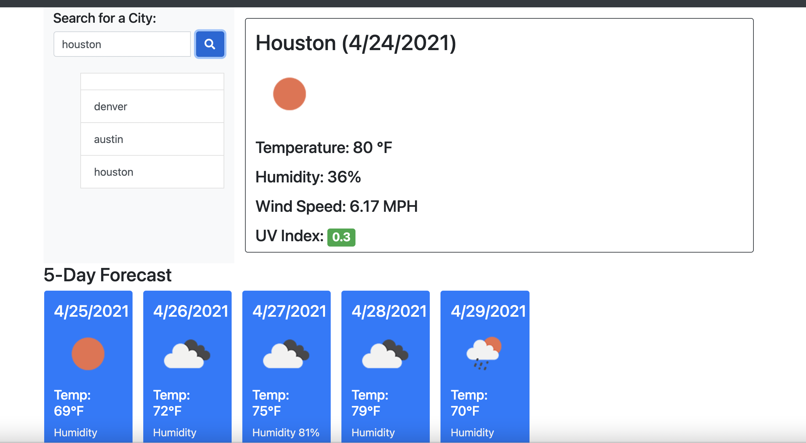

# 06-Server-Side-API's- Weather Dashboard

## Description
This is a simple JavaScript app that uses two different api calls (both from openweathermap) to generate weather data for a given city and stores the data in local storgage.

## Installation
There is no installtion necessary to run the application.  Simply run the index.html from a server browser and enter a city, click the search bar and the weather is generated.

## License

This application is covered by the MIT license. 

## GitHub username: 
spaulsen-creator 
## Email Adress:
spaulsen68@yahoo.com
## Code:
https://github.com/spaulsen-creator/06-server-side-apis

## Deployed app:
https://spaulsen-creator.github.io/06-server-side-apis/